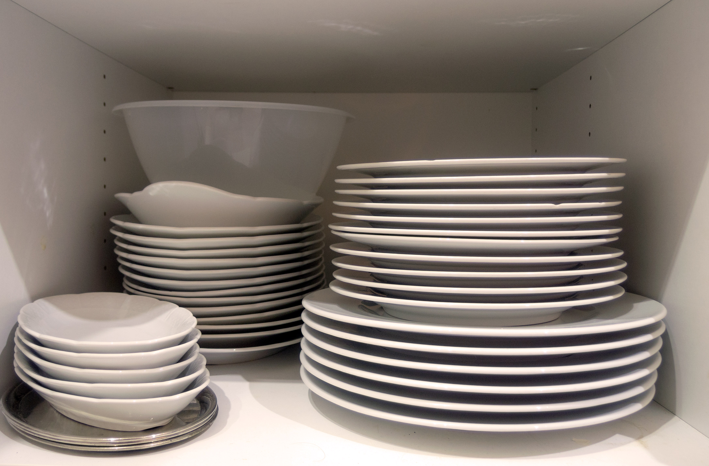

# Guide Chapter 1 - The Stack

In the introduction, it was mentioned that Vyxal is a stack-language. But what is a stack? How does it work? Can it be used to completely conquer my political enemies? These are all questions that will be answered in this chapter.

## Stacks - Something You Probably Already Know

If you've ever been in a kitchen with plates, you've most likely1 seen a stack:

A stack of plates is a very good analogy for a stack in Vyxal. It demonstrates that you can:

- Add plates to the stack ("push" a "value" onto the stack)
- Remove plates from the stack ("pop" a "value" from the stack)
- Take several plates from the stack, and do things with the plates ("operate" on the stack)

In Vyxal, data is used instead of plates. Data includes:

- Numbers (`69`, `420`, `1337`, `69420`, etc.)
- Strings (`"Hello, World!"`, `"Vyxal is the best!"`, `"Epic Rizz"`, etc.)
- Lists (`[1, 2, 3]`, `["Hello", "World"]`, `[1, "Hello", 3]`, etc.)
- and Functions (more on this later)

The stack is something that exists in the background of every program. 

## Footnotes

1. Assuming that the kitchen you were in was organised nicely. A clean kitchen would have its plates stacked neatly in a cupboard. If you've never seen a stack of plates, you should probably go clean your kitchen. 
